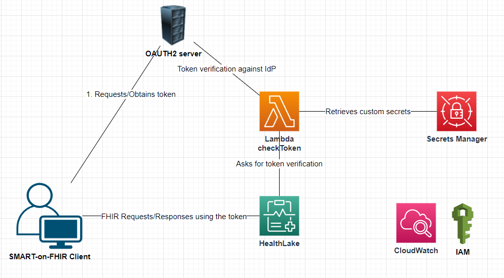

# "SMART-on-FHIR enabled HealthLake Datastore" Project

For licensing information refer to LICENSE file

## Introduction

This package deploys on AWS an SMART-on-FHIR (SoF) enabled HealthLake (HL) datastore and the related infrastructure:
- the SoF-enabled datastore
- the Lambda function called by the HealthLake datastore
- the IAM roles and permissions necessary for HL, Lambda 
- the Secrets Manager secret which stores the confidential information (such as client_id, client_secret, api_secret, logging level etc.)



You may use the IdP OAuth2 provider of your choice for this software. This software was tested and can work with an IdP OAuth2 provider, such as [ORY OAuth2 service](https://console.ory.sh).

CHECK [the documentation](https://docs.aws.amazon.com/healthlake/latest/devguide/smart-on-fhir.html) for more information about deploying a SMART-on-FHIR HealthLake datastore

## Deployment Procedure

Clone the repository to your local computer:  
```
git clone https://github.com/aws-samples/smart-on-fhir-healthlake.git  
cd smart-on-fhir-healthlake
```  
Install the dependencies:  
```
npm install  
cd lambda  
npm install
```

Open the *cdk.context.json* file and update the fields.

**account** - your AWS account number  
**region** - the region in which these resources will be deployed  
**tagName** & **tagValue** - the name and the value that each resource will be tagged with  
**prefix** - the prefix to be added to each resource in the stacks  
**datastoreName** - the name of the HealthLake datastore to be created  
**preloadData** - determines whetehr the Healtlake datastore will be empty or pre-populated with data. If *true* the **preloadDataType** parameter must be set  
**preloadDataType** - the type of data that will prepopulate the Healthlake datastore (surrently only *SYNTHEA* is supported)  
**clientId** - the client ID used to authenticate against the OAUTH2 server  
**clientSecret** - the client secret used to authenticate against the OAUTH2 server  
**authEndPoint** - the base url for the OAUTH2 server  
**authEndpointToken** - the url for requesting a token from the OAUTH2 server  
**authEndpointIntrospect** - the url for introspecting a token with the OAUTH2 server  
**srvAPIKey** - the API Key required by the third party - in case of using an OAuth2 service that requires such API key  
**lambdaConcurentExecutions** - the number of concurent execution for the lambda function called by HealthLake to verify tokens 
**lambdaEnhancedLogging** - boolean. If this is set to *true*, the lambda function will create more entries in the CloudWatch logs, **AND WILL LOG THE SECRET VALUE OF THE IDP**. However, no PHI/PII will be logged. After deployment, the value can be changed (true/false) in AWS Secret Manager console*.  

Also, in the *cdk.json* file remove or adjust the value of *profile* and *requireApproval* attributes  

To deploy the resources in AWS simply issue the command:
```
cdk synth --all
cdk deploy --all
```
## Remove All Resources

To remove all the resources created in the previous section, navigate to the repository folder in a command/console window on your computer and issue:
```
cdk destroy --all
```
[!WARNING] This will remove the datastore, all the data stored in it and the adjacent resources. This operation will cause irreversible data loss!

## Running the Lambda Functions Manually

HealthLake will invoke the *checkToken* Lambda function automatically, for every API call received.  
However, for testing or validation purposes the Lambada function(s) can be run manually too, following the instructions below:  

### Verify an existing token
- In the AWS console open the Lambda console and navigate to the *prefix-*checkToken function
- go to Test tab and create an event with the following structure:
```
{
    "datastoreEndpoint": "https://healthlake.us-east-1.amazonaws.com/datastore/<datastore-id>/r4/",
    "bearerToken": "<oauth2-token>",
    "operationName": "SearchWithGet"
}
```
where *datastore-id* is the datastoreID of the deployed HealthLake datastore, and the *oauth2-token* is the token to be verified 
- Give the event a name, *Save* it and then click *Test*
- in the *Log Output* section you should see the answer from the OAuth2 Server/service

## FAQ

1. **What if the response is "Timeout during custom Idp execution."**  
The Lambda function returned the token verification response back to the HealthLake datastore in more than 1 second (1000 ms) from receiving of the request (or never returned it). This is common when the Lambda function has a cold start. Make sure that the lambda function is inquired periodically, or increase the computational capacity and/or lambda's lambdaConcurrentExecutions parameter to minimize the total lambda function execution time.

2. **How can I monitor the execution flow of the lambda function?**  
Set the *"lambdaEnhancedLogging"* parameter to *"true"* (including the quotes) for enhanced logging and verify the log entries in AWS CloudWatch --> Log Groups console. After deployment you can change the value back to *"false"* in AWS Secret Manager console.
WARNING!!! Turning the enhanced logging on wil cause the secret and other sensitive information to be recorded in the CloudWatch logs.

3. **How can I monitor HealthLake activity?**
The API calls and metrics are recorded in CloudWatch. Please see details in [this article](https://docs.aws.amazon.com/healthlake/latest/devguide/monitoring-cloudwatch.html).


4. **How can I protect my data in the HealthLake datastore?**  
Do not run cdk command with *destroy* parameter. 
See also [this article](https://docs.aws.amazon.com/healthlake/latest/devguide/data-protection.html)  

5. **What is the format of the response HealthLake expects from the Lambda function?**
A successful response accepted by HealthLake from the Lambda function has the following format. See more details [here]().
```json
{
    "authPayload": {
        "iss": "https://main-oauth2-server-link.com/oauth2/token",
        "aud": "datastore-endpoint-uri",
        "iat": 1700584500,
        "nbf": 1700584500,
        "exp": 1700588100,
        "isAuthorized": true,
        "scope": "system/*.*"
    },
    "iamRoleARN": "arn:aws:iam::123456789012:role/sof-hl-Role-for-HealthLake"
}
```

\* NOTE: by default the Secret Manager's permissions only allow access to the Lambda function. In order to change the value of *lambdaEnhancedLogging* parameter, you need to change the resource permissions of the secret as follows:
1. Log into the AWS console with a user account with modifying permissions rights
2. Navigate to Secrets Manager -> SOF-HL
3. Scroll to *Resource permissions* section and click *Edit permissions*
4. In the *Statement []* array, add another object of the following structure. 
```json
{
    "Sid" : "AdminAccessAllowModification",
    "Effect" : "Allow",
    "Principal" : {
      "AWS" : "arn:aws:iam::AWS_ACCOUNT:user/CURRENT_USER"
    },
    "Action" : "secretsmanager:*",
    "Resource" : "SECRET_ARN"
  }
```  
5. Replace *AWS_ACCOUNT* with your account number, *CURRENT_USER* with the ARN of the user you are logged in and *SECRET_ARN* with the ARN of the SOF-HL secret found in the *Secret details* section.
6. In the *Condition* section of the *SOFSecretManagerDeny* add your userId so the condition statement will look similar to this:
```json
"Condition" : {
      "StringNotLike" : {
        "aws:userId" : ["AROA4XXXXXXXXXXXXXXXX:*", "AROA4XXXXXXXXXXXXXXXX:*"]
      }
}
```  
7. Click *Save*  
8. Now you should be able to modify the *lambdaEnhancedLogging* parameter to true/false value